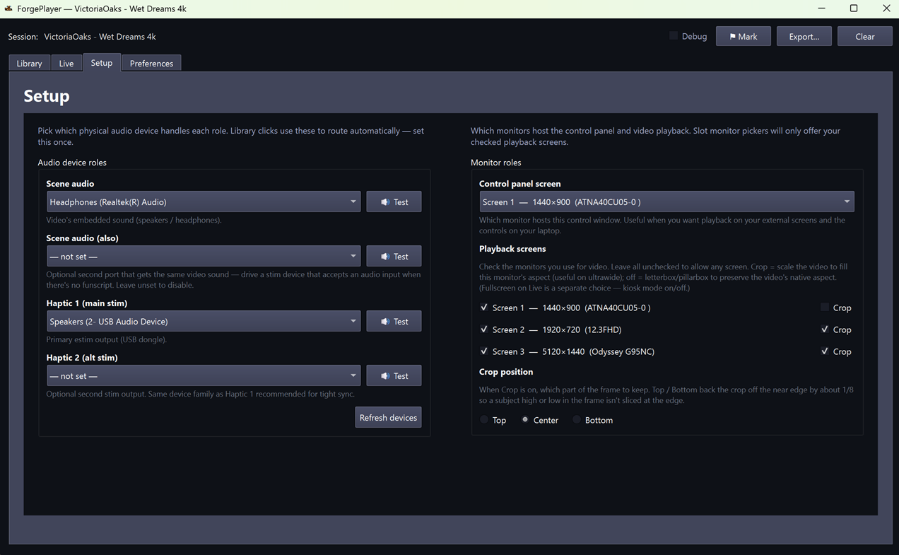
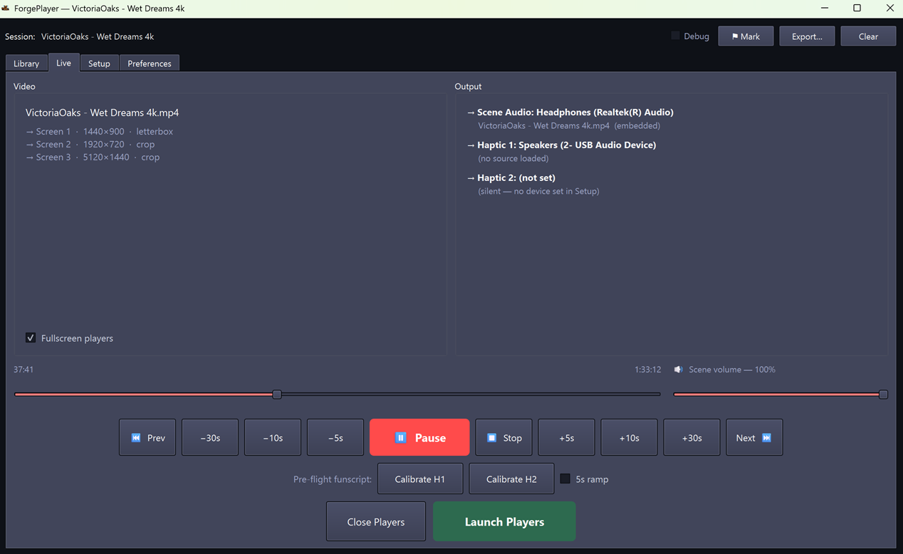

# Getting Started with ForgePlayer

First-time setup, from "I just downloaded this" to "video playing on my
monitor and stim coming out the dongle." If you've used VLC + restim
separately and want everything on one timeline, this is the path.

---

## What you need

- A Windows / macOS / Linux machine with a working audio output
- One or more **USB audio dongles** if you're using stim — these are
  the small USB devices that show up to Windows / macOS as an audio
  output and feed your stim hardware (any device you'd otherwise plug
  into restim directly will do; technically these are USB audio DACs —
  Digital-to-Analog Converters)
- Optional: a second USB audio dongle for a **prostate channel**
  (Haptic 2)
- Optional: a second monitor for mirror playback
- Optional: a **GPU is not required** — integrated graphics play 1080p and
  typical 4K fine. Any GPU with hardware video decoding (NVIDIA, AMD, or
  Intel) plays **large / high-bitrate 4K videos more smoothly** by offloading
  decode from the CPU
- A **scene folder** — see [The Pack](#the-pack) below

---

## Install

Pick a build for your platform and run it. No Python install, no libmpv
install — everything is bundled.

- **[forgeplayer.app](https://forgeplayer.app/)** — direct download buttons
  for Windows / macOS / Linux on the landing page.
- **[GitHub Releases](https://github.com/liquid-releasing/forgeplayer-releases/releases/latest)** —
  same builds, plus older versions and changelogs.

| Platform | File | How to run |
|---|---|---|
| Windows | `ForgePlayer-Setup.exe` (installer) or `ForgePlayer-windows.zip` (portable) | Run the installer (registers `.forge` double-click), or unzip and run `ForgePlayer.exe` |
| macOS | `ForgePlayer-macos.zip` | Unzip, open `ForgePlayer.app` (right-click → Open the first time, since the app isn't notarized yet) |
| Linux | `ForgePlayer-linux.tar.gz` | Extract, run `ForgePlayer/ForgePlayer` |

!!! note "Windows: keeping the download past SmartScreen"
    ForgePlayer isn't code-signed yet, so Windows flags it as an unknown
    publisher — the file is safe, you just have to allow it. **In your browser**
    the download may be blocked: open Downloads → **⋯ / Keep → Keep anyway**.
    **On first run** a blue "Windows protected your PC" box appears: click
    **More info → Run anyway**. This is a one-time step per download.

The window opens with five tabs: **Library**, **Live**, **Setup**,
**Preferences**, **About**.

### Run from source (developers)

If you'd rather hack on the code:

1. Install Python 3.11+ (3.12 or 3.13 is fine).
2. Install libmpv:
   - **Windows:** download the latest mpv build from
     [mpv.io/installation](https://mpv.io/installation/) and place
     `libmpv-2.dll` next to `main.py` or anywhere on `PATH`.
   - **macOS:** `brew install mpv`
   - **Linux:** `sudo apt-get install libmpv-dev` (Debian / Ubuntu) or
     equivalent.
3. Clone and install Python deps:
   ```
   git clone https://github.com/liquid-releasing/forgeplayer.git
   cd forgeplayer
   python -m venv .venv
   .venv/Scripts/activate           # Windows
   source .venv/bin/activate        # macOS / Linux
   pip install -r requirements.txt
   ```
4. Run: `python main.py`

---

## The Pack

A "scene" is one folder containing the video, optional sibling audio
files, optional funscripts (one or many), and any pinned picks. Sample
layout:

```
my-scene/
  my-scene.mp4                                    <- main video
  my-scene[E-Stim _Popper Edit].mp3               <- pre-rendered stim audio (optional)
  my-scene.funscript                              <- main funscript (1D position track)
  my-scene.alpha.funscript                        <- explicit alpha axis (optional)
  my-scene.beta.funscript                         <- explicit beta axis (optional)
  my-scene.alpha-prostate.funscript               <- prostate channel for Haptic 2 (optional)
  my-scene.prostate.wav                           <- pre-rendered prostate audio (optional)
```

Drop the folder anywhere readable. ForgePlayer scans it on first
Library refresh and remembers it after that.

---

## First launch — the 60 second tour

### 1. Pick your audio devices (Setup tab)

- **Scene Audio** — where the video's mp3 / mp4 audio plays. Usually
  your headset or speakers.
- **Haptic 1** — your main stim USB dongle.
- **Haptic 2** — second USB dongle for prostate, OR **leave unset** if you
  only have one stim box.

The dropdowns show every audio output Windows reports. If your dongle isn't
there, plug it in and click **Refresh devices**. If a stim port later reads
**(unavailable — reselect in Setup)**, that port stays **silent** and you just
reselect it — ForgePlayer never routes e-stim to your speakers. Use **wired /
USB** outputs; Bluetooth audio is untested.



### 2. Choose a content preference (Preferences tab)

- **Sound files (.wav / .mp3)** — default, recommended. ForgePlayer
  plays pre-rendered stim audio when a scene ships one. No live
  synthesis. This is the cleanest path.
- **Funscripts (live synth)** — synthesizes stim from the funscript in
  real time (vendored restim threephase). Pick this only if your
  scenes ship funscripts but no stim audio file, or if you want the
  algorithm-tunable path.

When the preferred form isn't available for a scene, Haptic 1 falls
back to the other form so you don't get silent stim.

### 3. Open a scene (Library tab)

- Click **Refresh** if the library is empty.
- Click a scene tile. A picker dialog opens listing variants:
  funscript sets, video variants, stim audio variants, subtitles.
  Pick whichever you want (defaults are sensible — the "matched" tag
  next to a stim audio file means it shares the scene's main stem).
- Click **OK**. Picks are saved per-scene and replayed automatically
  next time you click that tile.

### 4. Watch (Live tab)

- The **Live** tab now shows your scene loaded into the slots.
- The **Output** panel shows what's routing to which device:
  `Scene Audio → ...`, `Haptic 1 → ...`, `Haptic 2 → ...`.
- Click **Launch** to open the player windows on the configured
  monitors. The control window stays where you have it.
- Click **Play**. Video plays on your monitor; stim drives Haptic 1
  (and Haptic 2 if configured); audio plays on the scene-audio device.



That's it. Seek with the timeline, ±5/10/30 s with the buttons, scene
volume with the slider beside the timeline.

---

## Pre-flight check: Calibrate

Before you wire yourself up, click **Calibrate H1** (and **H2** if you
have it set). The button generates a steady **test tone** (not a
sample of any scene audio — a synthesized continuous carrier) and
sends it to the configured haptic dongle for ~30 seconds, with an
optional 5 s ramp-up if the **5 s ramp** checkbox is on. Use this to:

- Confirm the dongle is connected and getting signal.
- Set your levels at the dongle's physical knob *before* turning the
  body up.
- Position electrodes / pads with a steady output you can tune to.

Click the button again to stop. The test tone is identical for every
scene — it's a signal-path check, not a content preview.

---

## What "Debug" does

Top bar has a **Debug** toggle. When ON:

- Every UI event, every audio callback boundary, every seek, every
  auto-resync gets logged
- Logs stream to `~/.forgeplayer/debug-stream-<timestamp>.jsonl`
- The **⚑ Mark** button records a timestamped marker — use it during
  dogfood when you hear / feel / see something weird, so the post-mortem
  can correlate
- **Export** writes a single JSON snapshot of the in-memory event
  buffer

Off by default; zero overhead when off.

---

## Troubleshooting

- **No sound on a Haptic port / it reads "(unavailable — reselect in
  Setup)"** — the saved device was unplugged or its Windows name changed
  (common after a reboot or USB re-plug). Reselect it in **Setup → Audio
  device roles** and click **Refresh devices**. The port stays silent until a
  device resolves — ForgePlayer will not route e-stim to your speakers. Still
  silent with a valid device? Try **Calibrate H1** to isolate wiring vs
  playback.
- **I hear e-stim through my computer speakers** — shouldn't happen in
  v0.0.14. Confirm **Haptic 1 / 2** point at your **USB dongle** (not
  "Speakers") and that **Scene Audio** is a *different* device.
- **HDR video looks washed-out / over-bright** — HDR passthrough is disabled
  in v0.0.14 for stability; turn **Windows HDR off** for the playback monitor.
- **Bluetooth output is glitchy** — Bluetooth audio is untested; use wired /
  USB, especially for stim.
- **WASAPI exclusive mode warnings** — the stim stream tried to grab the
  device exclusively and failed; it auto-falls-back to shared mode. Harmless.
- **Multi-monitor layout looks wrong after moving the control window** —
  known cosmetic limitation; post-alpha fix.
- **Closing a video closed the whole app** — that shouldn't happen. Grab
  `~/.forgeplayer/faulthandler.log` and file an issue. (A crash *as the app
  exits* is a separate, harmless teardown quirk.)

**Filing a bug report:** turn on **Debug** before reproducing, then attach
`~/.forgeplayer/debug-stream-*.jsonl` (session events) and, if it crashed,
`~/.forgeplayer/faulthandler.log` (native crash stack).

---

## Next steps

- [User guide](./user-guide/index.md) — feature-by-feature reference.
- [BACKLOG.md][backlog] (on GitHub) — what's coming next.
- [docs/architecture/][archdir] (on GitHub) — internal design docs:
  audio-routing model, restim channel taxonomy, stim synthesis. Read
  these if you're hacking on the codebase.

[backlog]: https://github.com/liquid-releasing/forgeplayer/blob/main/BACKLOG.md
[archdir]: https://github.com/liquid-releasing/forgeplayer/tree/main/docs/architecture
